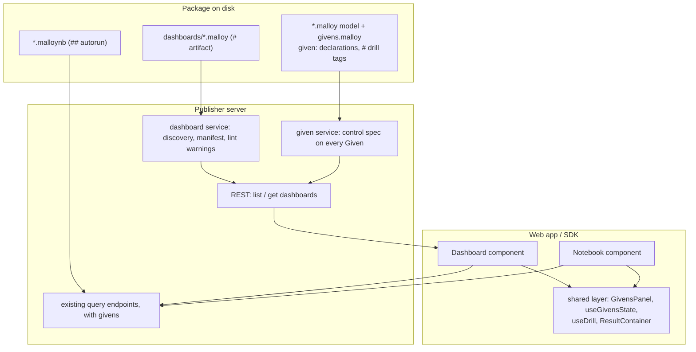

<!--
Copyright (c) Credible Data Inc.
SPDX-License-Identifier: MIT
-->

# Design: Malloyyo dashboards in Publisher

**Status: a design landed incrementally. Check before you trust it.** The implementation this
describes was built and reviewed on the dashboards branch
([#935](https://github.com/malloydata/publisher/pull/935)), which was a handoff rather than a merge
candidate. It was landed as a sequence of smaller pull requests, and this document went first so the
later ones had a single reference to build against.

Read every "shipped", "is in", and "Have" below as **true of that branch, not necessarily of
`main`**. This page deliberately does not say which parts have merged. Such a list is wrong within
days of being written and wrong in the most expensive direction, because it still reads as
authoritative. The authority is the pull requests themselves.

The design also lands **by halves** in places, so "has it merged" is often not a yes or no, and you
have to check both halves rather than one. The given control contract is the clearest case: the
control fields it puts on `Given` in the spec and the server code that derives them from a
declaration's tags are separate changes that need not arrive together. The dashboard REST surface is
another, being two endpoints, and discovery is a third: the server side can arrive before the
package-page section that surfaces it. Before building on any part of this design, read the open
and merged dashboard pull requests and look in the tree, rather than trusting a sentence here.
For the parts most often mistaken for one another, these are the files and symbols to look in. It is
a shortcut for those, not an inventory of the design:

| Part of the design                       | Lives in                                                        |
| ---------------------------------------- | --------------------------------------------------------------- |
| Given control contract, wire half        | the control fields on `Given` in `api-doc.yaml`                 |
| Given control contract, derived from tags | `readGivenControlSpec` in `packages/server/src/service/given.ts` |
| `dashboards/` discovery and the manifest | `packages/server/src/service/dashboard.ts`                      |
| The artifact / MOTLY tag primitives      | `packages/server/src/service/motly.ts`                          |
| The dashboard REST surface               | `packages/server/src/controller/dashboard.controller.ts`, plus its `dashboards` paths in `api-doc.yaml` |
| The viewer                               | `packages/sdk/src/components/Dashboard/`                        |

Phases 1 to 3 (discovery and REST, the tag-only viewer, `# drill`) and phase 5 (the `storefront`
dashboards, `docs/dashboards.md`, the skill) were built on that branch; phase 4 (custom JSX
components) was built and then **cut**, and that cut is a real decision that survives the split.
Per-item detail is in [Phasing](#phasing).

Paths, component names, and UI section labels describe the **end state** of the sequence. The rename
this document was written ahead of has since landed, so its Data Apps and Notebooks naming is the
tree's naming too. The dashboard-specific names are the ones still worth checking, and the table
above says where to look. Written July 2026, revised against the implementation.

**Related:** [security-posture.md](security-posture.md) (the trust boundary the JSX cut turns on),
[choosing-a-surface.md](choosing-a-surface.md) (when to reach for a dashboard over a notebook or an
HTML data app) and [dashboards.md](dashboards.md) (how to use the feature rather than read its
design).
Externally, Malloyyo's `docs/creating-dashboards.md`, `docs/composite-dashboards.md`, and
`docs/dashboard-iframe-security.md` are the format and security posture this design adopts.

## Goal

A Publisher package containing a Malloyyo-style `dashboards/` directory is discovered, listed,
and rendered natively in the Publisher Console — with the same annotation grammar, so **one model
repo works unchanged in both Malloyyo and Publisher**. Parity across the tag grammar: tag-only
dashboards, auto-rendered given filter controls, composite (multi-tile) dashboards, and `# drill`
click-through navigation, all of which are in. Malloyyo's one remaining feature, custom JSX
components, is deliberately **not** ported (§Custom JSX components: cut). What a portable repo
still waits on is the loader conventions in §Open questions, not the dashboards themselves.

The whole design is governed by one principle — **one engine, two document types**
(§[Guiding design principle](#guiding-design-principle-one-engine-two-document-types)).

Dashboards also ship as **standard React SDK components, usable separately from the Publisher
UI**: the `Dashboard` component (and the pieces it composes) are public exports of
`@malloy-publisher/sdk` that any React app can render against a Publisher server. The Publisher
Console is one consumer of that component, not its home (§[The Dashboard
component](#the-dashboard-component-tag-only-path)).

**Non-goals (for this design):**

- No MCP surface for dashboards. They are a human/UI artifact; agents keep using
  `malloy_getContext` / `malloy_executeQuery` against the underlying models.
- No query log / share links. Worth having, but a server-wide concern rather than a dashboards
  one, so it is tracked separately.
- No converter to `.malloynb` — dashboards render natively, they are not translated.

## Background: what a Malloyyo dashboard is

A dashboard is a **self-contained** `.malloy` **file in the package's** `dashboards/` **directory**. The
file _is_ the dashboard: it imports the model parts it needs, defines its query (with the
filtering it applies), and tags it. The filename is the dashboard's name — its URL slug and its
`# drill` target.

```
your-model/
  ecommerce.malloy       # sources, reusable views/measures, # drill tags
  givens.malloy          # given: declarations (the filter controls)
  index.malloy           # the curated data surface
  dashboards/
    overview.malloy      # one dashboard — imports the model, declares its query
    seasonality.malloy
```

The grammar, in brief (full reference: Malloyyo's `creating-dashboards.md`):

| Construct                                                                                                                | Meaning                                                                                                                                                                                                                                                                |
| ------------------------------------------------------------------------------------------------------------------------ | ---------------------------------------------------------------------------------------------------------------------------------------------------------------------------------------------------------------------------------------------------------------------- |
| `# artifact { title="…" givens {X=f'…'} autorun=false }` on a `query:`/`view:`                                           | Declares the dashboard. `title` falls back to the `#"` doc comment; `givens` sets per-dashboard starting control values; `autorun=false` batches filter changes behind an Apply button.                                                                                |
| `## artifact { title tiles=["src -> view", …] dashboard_columns=N }` (model-level)                                       | Declares a **composite** dashboard: named existing views run separately and combined into one grid. **Publisher diverges here**, see §Where Publisher diverges.                                                                                                        |
| `# dashboard {columns=N}` + `# colspan=K` + `# break`                                                                    | The renderer grid. Standard `@malloydata/render` tags — a layout tag above an `aggregate:`/`nest:` block applies to every item in the block.                                                                                                                           |
| `given:` declarations with `# label=`, `control=select\|multiselect`, `range_min/max`, `suggest { query=… dimension=… }` | Typed filter inputs (`filter<string\|number\|timestamp\|date>`). Each given a dashboard's query references auto-renders as a control; the dashboard applies it via `where: field ~ $NAME`. Declarations are a model concern; each dashboard decides its own filtering. |
| `# drill { to=[slug\|self] given=… }` on a source `dimension:`                                                           | Clickable cells: navigate to another dashboard seeding the clicked value into its given (the given is the dimension name verbatim unless `given=` overrides), or `self` to filter in place. Multiple destinations pop a menu.                                                        |
| `dashboards/<name>.jsx` / `.tsx`                                                                                         | Malloyyo's custom React component. **Not supported** — ignored, with a load-time warning (§Custom JSX components: cut).                                                                                                                                                |
| A `dashboards/*.malloy` with **no** artifact tag                                                                         | A shared include (skipped by discovery).                                                                                                                                                                                                                               |

Malloyyo also ships a `lint` verb: every dashboard file compiles as its own entry, every tile /
suggest query compiles, `dashboard_columns` is a positive int, every `# drill { to=… }` resolves
to a real dashboard file, and no component is orphaned or points at a missing query.

Requires `@malloydata/malloy` 0.0.423+ (earlier versions drop annotations on refined nests).

## Where Publisher stood, and what was added

Publisher already had most of the foundation; the work was a discovery/manifest layer and a
dashboard UI surface.

| Foundation                                                        | Where                                                                                                                                                                                                                                         | Status                                           |
| ----------------------------------------------------------------- | --------------------------------------------------------------------------------------------------------------------------------------------------------------------------------------------------------------------------------------------- | ------------------------------------------------ |
| Dashboard files compile and are queryable                         | Publisher compiles every `.malloy` in a package; `POST …/models/dashboards/overview.malloy/query` with `queryName` + `givens` works today                                                                                                     | Have                                             |
| Renderer grid (`# dashboard {columns}` / `# colspan` / `# break`) | `@malloydata/render` — the Publisher SDK is above the 0.0.423 floor Malloyyo requires (`^0.0.427` at the time of writing); `.malloy-dashboard` chrome is themed in `packages/sdk/src/components/RenderedResult/`                              | Have                                             |
| Givens: declaration, REST forwarding, form UI                     | [givens.md](givens.md); `givens` on query/compile endpoints; `GivensPanel` / `GivenInput` / `useGivensState` in the SDK, shared by both surfaces                                                                                              | Have, control-tag enrichment included            |
| Render-tag validation at load and query time                      | `@malloydata/render-validator` in the server                                                                                                                                                                                                  | Have                                             |
| Iframe + postMessage plumbing                                     | `DataAppViewer` + `packages/sdk/src/utils/dataAppEmbed.ts` (HTML data apps)                                                                                                                                                                         | Have; unused by dashboards, which render in-page |
| `# artifact` discovery, given/control specs                       | Ported from Malloyyo's `@malloyyo/mcp-engine` (`artifacts.ts`, `given-specs.ts`) into `service/dashboard.ts` + `service/motly.ts` + `service/given.ts`. Its `frame-runtime/` and `bundle.ts` are **not** ported (§Custom JSX components: cut) | Ported (MIT)                                     |

**Sourcing strategy:** port the small MIT-licensed Malloyyo modules (with attribution) rather
than depending on `@malloyyo/mcp-engine`, which is a private workspace package. The grammar is the
contract and the code is an implementation detail, so it was ported byte-compatibly and stayed that
way until the grid width diverged (below). The grammar **will** get a shared home: a malloydata
package holding the `# artifact` grammar + given-spec introspection that both projects consume, so
the formats cannot drift. That extraction is a committed follow-up
(§[Follow-ups](#follow-ups)), and the divergence is now an input to it rather than a detail.

### Where Publisher diverges

One property, deliberately. **Publisher does not read `dashboard_columns`.** The grid width is
`# dashboard { columns=N }` beside the artifact tag, which is the tag `@malloydata/render` already
reads on a tagged `query:`, so one spelling covers both and there is no second name to learn.
Publisher reports `dashboard_columns` as a property it does not read rather than ignoring it, so a
Malloyyo model repo says what it lost instead of quietly laying out at the default width.

Publisher also reads the renderer's per-child dashboard tags (`# colspan`, `# break`, `# subtitle`,
`# borderless`, and `# label`) off the view a tile names, and lays its own grid out from them.
Malloyyo's composite has no per-tile layout, so this is additive: a model using it renders as
Malloyyo does today, plus the layout.

Both belong in the shared-home conversation. If that package keeps `dashboard_columns`, Publisher
re-adds the reader; the enumeration lint is what makes either direction visible to an author.

## Guiding design principle: one engine, two document types

Publisher already has a multi-query analytic artifact — the `.malloynb` notebook — and the
overlap with dashboards is substantial: both run queries with givens through the same endpoints,
both render through `ResultContainer` → `@malloydata/render` (a notebook cell tagged
`# dashboard` already renders a grid today), and notebooks already have a Parameters panel
(`GivensPanel` / `GivenInput`). A composite dashboard (tiles + a shared control row) is close to
a notebook (cells + a Parameters panel) squinted at.

They are **not** merged into one format, because they serve different reading modes:

|               | Notebook (`.malloynb`)                                                          | Dashboard (`dashboards/*.malloy`)                                            |
| ------------- | ------------------------------------------------------------------------------- | ---------------------------------------------------------------------------- |
| Reading mode  | Narrative — author-ordered markdown + queries, read top-to-bottom; a data story | Operational — one grid behind a shared filter row, at a glance               |
| Layout        | Vertical document flow                                                          | `# dashboard {columns=N}` grid                                               |
| Interactivity | Filter controls, `autorun`/Apply, URL-addressable state, `# drill`              | Filter controls, `autorun`/Apply, URL-addressable state, `# drill`           |
| Format        | Malloy's notebook format — also authored and run in the VS Code extension       | Plain Malloy — portable, near-identical to Malloyyo's (the migration story)  |

The Interactivity row repeats itself deliberately: it is the row where the principle below is
already cashed out, and the two cells are the same because the code behind them is the same one.
The rows that differ are about the shape of the document, which is the whole basis for keeping
two of them.

Folding dashboards into the notebook format would break the Malloyyo compatibility that
motivates this design; growing notebooks a grid mode would duplicate what composite dashboards
already are. So the principle: **the document types stay distinct, and the machinery underneath
is unified — one engine, two document types.** Every capability in this design lands once, in
the shared layer, and both surfaces consume it; a feature is implemented per-document-type only
when it is inherently about that document's reading mode. Concretely (1–8 have shipped, bar the
notebook side of 2; 9 is documentation, not code):

1. **One controls layer.** The control-tag enrichment (§Web app: `label=`, `control=select` /
   `multiselect` with suggest-backed options, range sliders, filter-typed date pickers) lives in
   the shared `packages/sdk/src/components/given/` components, which notebooks already used — so
   notebooks inherited the richer controls for free, and `filter<…>` stopped rendering as a bare
   text box everywhere. "Exactly one" was made literally true rather than approximately: the
   notebook's separate Dimension Filters panel and the `useGivensForm` hook behind it were
   deleted, not left beside the shared one. That panel drove the deprecated `filter_params`
   query path, so a second controls implementation was also a second _server_ path; keeping it
   would have meant investing in both.
2. **One given-spec introspection.** The server-side "which givens does this query reference,
   with which control tags and suggest queries" work (§Server design) serves both surfaces. The
   control contract rides on every `Given` the API returns rather than on a dashboard-only
   type, so the dashboard control row and the notebook Parameters panel read the same field off
   the same declaration. Narrowing a notebook's panel to the givens its cells actually
   reference (it still shows every declared given) is the remaining half.
3. **One drill implementation.** `# drill` is declared on model _dimensions_, so it fires
   wherever that dimension is grouped — including notebook cells. Click handling is implemented
   once in `RenderedResult`; the host surface (notebook or dashboard) supplies the navigation
   handler. A notebook can therefore drill _into_ a dashboard, and `to=self` filters whichever
   document the click came from. The reader-facing half is shared on the same terms: the same
   hover affordance and the same menu, so the interaction does not tell you which kind of
   document you are in. The one thing that varies is the one thing that should — the menu names
   the surface it would filter ("Filter this notebook" against "Filter this dashboard"), because
   a tag on a shared dimension cannot know where it fired.
4. **One parameter-state convention.** Givens state is URL-addressable on both surfaces, from
   one `useGivensState` hook, so a filtered notebook is a shareable link exactly as a dashboard
   is and a drill can arrive anywhere with state. Precedence is the same everywhere: URL
   parameters beat the document's own starting values, which beat the declaration's defaults.
   Starting values are a tag on both surfaces, read through the same `readStartingGivens` —
   `# artifact { givens {…} }` on a dashboard, file-level `## givens {…}` on a notebook — and
   arrive as one field with one name (`startingGivens` on `DashboardManifest` and on
   `RawNotebook`). `DashboardManifest.givens` is a different field: the control-row declarations
   described below.
   Encoding is shared too, which matters more than it sounds:
   a `date` given has to go over the wire as a bare `YYYY-MM-DD` while a `timestamptz` needs a
   full ISO string, and getting that wrong is a 400 rather than a wrong answer — so
   `givensToRequest` reads the declared type and both surfaces call it.
5. **One run control.** `autorun=false` / Apply lives in the shared control row, not in the
   dashboard component: batching parameter changes behind an Apply button is _more_ valuable in
   a notebook, where a single control change re-runs every code cell in the document. The flag
   is read from a tag by both surfaces — `# artifact { autorun=false }` on a dashboard,
   file-level `## autorun=false` on a notebook, both through the same `readAutorun` — and
   defaults to autorun. It reaches the client as one field with one name: `autorun` on
   `DashboardManifest` and on `RawNotebook`.
6. **One run/render path.** The dashboard component composes the existing query endpoint and
   `ResultContainer`; nothing about rendering or execution forks.
7. **One lint.** The load-time package warnings (§Server design) are not scoped to
   `dashboards/`: the drill scan reads every compiled model, so a `# drill` reachable only
   from a notebook — or from a package with no dashboards at all — is validated the same way.
   A notebook's cells need no separate check, because a notebook compiles at load and a bad
   reference is already its compilation error. Malloyyo runs the equivalent checks from a
   `lint` CLI verb; running them at package load is the right place for a server, since it
   catches a bad file however it arrived. The gap is a `malloy-pub lint` verb, which would let
   the same check gate CI before deploy rather than only reporting after load.
8. **One title convention.** Package listings show a dashboard's manifest `title`, falling
   back to its `#"` doc comment; notebook rows resolve `## title="…"` then the same `#"` doc
   comment, so a notebook carries a human title instead of surfacing as a filename. Then one
   step the shared chain does not have: the first markdown heading. It belongs per-document
   under this principle's own carve-out — a notebook is prose and has a title already written,
   a dashboard has none to read — and it is what makes existing notebooks stop showing
   filenames without anyone editing them, the same bargain a `DataApp` makes by reading its
   `<title>`.
9. **Positioning guidance.** [choosing-a-surface.md](choosing-a-surface.md) carries the
   "notebook, dashboard, or HTML data app?" decision guide, and now says outright that
   interactivity is _not_ the axis to choose on, because these two surfaces behave the same;
   what differs is the shape of the document. [dashboards.md](dashboards.md) links to it rather
   than restating it. Cross-linking covers the seams: a notebook's markdown can link to
   a dashboard (both are URL-addressable), and a drill can jump from a notebook cell to a
   dashboard.

Merging the formats themselves is a non-goal, now and later: the principle is shared machinery,
not converged documents. It also cuts the other way — future work on either surface (new control
kinds, new drill destinations, richer lint) belongs in the shared layer first, so neither
document type drifts ahead of the other.

## Architecture



The two document types meet at the shared layer, and everything they have in common lives there
(§Guiding design principle). What is dashboard-specific is the left spine — the discovery service
and the two endpoints that read a manifest off an `# artifact` tag.

**One trust tier**, which is the deviation from Malloyyo worth naming up front. Every dashboard
is pure Malloy plus renderer tags — no authored code — so all of them render **in-page**, with
no iframe anywhere in this design. Malloyyo's second tier, a custom component sandboxed in an
opaque-origin iframe, is not ported (§Custom JSX components: cut).

## Server design

### Discovery and manifest

`packages/server/src/service/dashboard.ts`, run at package load:

1. Glob `dashboards/*.malloy`. Each file compiles **as its own entry** (Malloyyo "structure v2"
   — model annotations don't cross imports, so the artifact tag is only readable when the
   dashboard file is the entry). Publisher already compiles these files as models; discovery
   reuses those compiles.
2. Read the `# artifact` (query-level) or `## artifact` (model-level composite) tag into a
   manifest: title, description, the query or the tile list, grid width, starting given values,
   `autorun`, and the given specs below.
3. A `dashboards/*.malloy` with no artifact tag is a shared include — skipped, not an error.

The MOTLY parsing primitives the tags are read with live in `service/motly.ts` rather than in the
dashboard service, because a notebook needs them too: `## autorun=false` and `## givens { … }` are
read by the same `readAutorun` and `readStartingGivens` a dashboard's
`# artifact { autorun=false givens { … } }` goes through.

### Given specs (the control contract)

For the dashboard's query (or each composite tile), introspect **which givens it references**
and, from each declaration's tags, the control spec: name, type (`filter<…>`), label, control
kind, range bounds, and the `suggest` query. Composite dashboards get the **union** across
tiles for their control row, and each tile also records the given names _it_ references, so a
viewer can re-run only the tiles a changed control affects. This builds on the given extraction
in `packages/server/src/service/source_extraction.ts`.

Per the guiding principle, the control spec is **not** a dashboard-shaped type. Deriving it lives
in `service/given.ts` (`readGivenControlSpec`) and its fields ride on every `Given` the API
returns, so `CompiledModel.givens`, `Source.givens`, and `DashboardManifest.givens` all carry
the same contract and a notebook's Parameters panel reads it off the same declaration a
dashboard's control row does.

`givens` names a collection of *declarations* everywhere on the API. Values keyed by given name
are `GivenValues` (`EncodedGivenValues` in the string form a URL carries), a dashboard's or
notebook's declared starting values are `startingGivens`, and a bare list of names is
`givenNames`. One word, one meaning, was worth the rename.

Two Malloy rules shape this, both established against the compiler rather than assumed:

- **Bindability is per-file, and it is the entry file's import list that decides.** A tile can
  reference a given that lives up an import chain (`orders -> by_region` filtering by `$REGION`
  declared in `givens.malloy`), but the dashboard file can only be _run_ with the givens it
  imports itself; any other name fails with "unknown given". So the control row is the model's
  **surfaced** given set, not every declaration in the compile closure — advertising a control
  the server would reject is worse than showing none. A composite therefore has to import the
  givens its tiles filter by even though nothing in the file mentions them, and the lint says so
  when it doesn't.
- **A surfaced given a query does not reference is ignored, not rejected.** Running a tile with
  the whole control row is safe, which is what makes the per-tile lists an optimization rather
  than a correctness requirement.

### REST surface

Two read endpoints (in `api-doc.yaml`, so the SDK client is generated):

- `GET /api/v0/environments/{env}/packages/{pkg}/dashboards` — a list of `Dashboard` entries:
  slug, file path, title, doc-comment description, and a compile `error` when the file has one.
- `GET …/packages/{pkg}/dashboards/{name}` — a `DashboardManifest`: the list fields plus the
  `query` or `tiles`, `dashboardColumns`, `startingGivens`, `autorun`, and `givens` (the control
  row, with per-tile `givenNames` for a composite).

**Running needs no new endpoint.** A dashboard's query, a composite's tiles, and a control's
suggest query all run through the existing `POST …/models/{path}/query` (named query, or
restricted ad-hoc `source -> view`) with `givens` — the same governed path every other query
takes, so row caps, byte caps, authorize gates, and render-tag validation all apply for free.
No dashboard-specific run endpoint exists, and with custom components cut there is no asset
endpoint either — these two reads are the whole dashboard surface.

### Load-time lint (package warnings)

Mirror `malloyyo lint` on the existing package-warnings surface (`Package.warnings`, alongside
the render-tag findings) rather than a new verb. Loud at load, where authors see it — not at
click time. Advisory throughout: a finding never costs the package its dashboards.

Checked: a plain `source -> view` or bare-name tile resolves; the grid width is a positive
integer; a tile filters by a given the entry file can actually bind (above); a `suggest`'s
`query=` or `source=`/`dimension=` resolves in that file; every `# drill { to=… }` names a real
dashboard or `self`, and a `to=self` has a given somewhere in the package to write the clicked
value into; no component file sits beside a dashboard that doesn't exist. Compilation itself is
not rechecked — every dashboard file already compiles as its own entry during the ordinary
package load, and a failure there surfaces as that model's compilation error.

**The drill checks read every model, not just `dashboards/`.** They are the one part of the lint
that is not about a dashboard file, because `# drill` is declared on a model dimension: a tag
that only a notebook can reach, or one in a package with no dashboards at all, is exactly as
broken and is caught the same way. That also means a package needs no dashboards to get drill
findings, which is the shape "one lint over both surfaces" takes here.

The lint is deliberately conservative about what it calls broken. A tile can be any runnable
Malloy, including a refinement (`orders -> by_brand + { limit: 5 }`) that discovery does not
resolve statically, so only forms that can be _proved_ wrong are reported; anything else is left
alone rather than warned about speculatively. Drill targets are keyed on the dimension, not the
dashboard, because a tagged dimension is reachable from every dashboard importing its source and
one broken target should be reported once.

Still deferred: notebook cell references — the "one lint" half of the guiding principle that has
not shipped.

## Web app / SDK design

### The Dashboard component (tag-only path)

The SDK `Dashboard` component (`packages/sdk/src/components/Dashboard/`). It is a **standard,
host-agnostic React component** — a public SDK export any React app can use separately from the
Publisher UI, the way `examples/data-app` consumes `QueryResult` and `Notebook` today. That
means:

- **Props, not routes.** The component takes `resourceUri`
  (`publisher://environments/{env}/packages/{pkg}`) and the dashboard's `dashboard` slug, plus
  optional `givens` / `onGivensChange` for controlled state, `onNavigate` for drill, and
  `height` / `maxResultSize`. It fetches everything else itself and reads nothing from the
  Publisher Console's router, layout, or chrome. `Notebook` takes the same `givens` /
  `onGivensChange` / `onNavigate` trio, so a host wires either surface the same way.
- **Injected navigation.** Anything that leaves the dashboard — a `# drill` to another slug —
  goes through the `onNavigate` callback. The Publisher Console maps it onto its routes; an external
  host maps it onto its own (or renders another `<Dashboard>` in place).
- **URL state is the host's job.** The component exposes its givens state via a controlled-props
  option; the Publisher Console syncs it to query params for shareable URLs, and an external host can
  do the same or manage state however it likes.
- **Part of the SDK's public surface.** The SDK is the supported way to use Malloy's renderer,
  notebook, and dashboard types in a React data app (`docs/react-data-apps.md`);
  `Dashboard` joins it as a first-class component — Malloyyo-compatible dashboards become
  embeddable analytics for any React app, not just Publisher pages.

The component:

1. Fetch the dashboard detail (manifest + given specs).
2. Render the **title**, a **control row**, and the **result panel**.
3. Controls: extend the **shared** `GivenInput` / `GivensPanel` (already used by notebooks) to
   honor the Malloyyo control tags — `label=`, `control=select` / `multiselect` (options from
   the `suggest` query, run through the query endpoint), `range_min/max` sliders for
   `filter<number>`, date pickers for `filter<timestamp|date>`, search boxes otherwise. `f''`
   (empty) is the natural "All". This is deliberately an enrichment of the existing components,
   not a fork — notebooks pick up the same widgets (see §Guiding design principle).
   These controls do not send what the user picked; they send _filter syntax_ built from it — a
   multiselect becomes `Nike, Levi's`, a slider becomes `>= 100` — because a `filter<T>` given
   takes a filter expression as its value. That translation is the one place a control can
   silently mean something other than what was clicked, so it lives in one tested module
   (`components/given/filterValue.ts`) and the syntax it emits is pinned by an integration test
   that runs it through a real compile rather than trusting the encoder in isolation.
4. State: initial values = `# artifact givens {…}` defaults, overridden by URL query params
   (shareable state, and the drill seeding mechanism). A control change re-runs
   (`autorun` default) or arms an Apply button (`autorun=false`).
5. Run via the query endpoint with the current givens; render through the existing
   `ResultContainer` / `RenderedResult` — the `# dashboard {columns}` grid renders natively.

Composite dashboards run each tile independently (with only that tile's givens) and combine the
results into one grid, per Malloyyo's `combine.ts`; the control row is the union.

### Console integration

The Console consumes the SDK component like any other host; nothing dashboard-specific lives in
`packages/app` that an external consumer would need. The concrete integration, mapped onto the
Console as it is today:

**Discovery: a Dashboards section on the package page.** The package page
(`packages/sdk/src/components/Package/Package.tsx`) is stacked `PackageSection`s — Notebooks,
Data Apps, Semantic Models, Package Data, Materializations. Dashboards get a new section fed
by the new list endpoint (a generated `apiClients.dashboards` client, same pattern as
`apiClients.dataApps`), each row showing the manifest `title` with the slug as the secondary line.
Place it **first**: a dashboard is the at-a-glance artifact a package visitor most likely wants,
ahead of notebooks and models. Two list-hygiene rules keep entries canonical:

- The **Semantic Models** section excludes `dashboards/*.malloy` files that carry an artifact tag
  (the server's discovery already knows which they are) — a dashboard appears once, in the
  Dashboards section. Untagged shared includes in `dashboards/` stay out of both lists.
- Empty section hidden, like Data Apps today.

**Routing: a branch in the catch-all, keyed on the extension.** `createMalloyRouter`
(`packages/app/src/App.tsx`) routes `/:env/:pkg/*` to `ModelPage`, which branches on extension —
`.malloy` opens the Explorer-style `Model` view, so a dashboard file must not fall through to it
as its primary experience. The URL is:

```
/:environmentName/:packageName/dashboards/:dashboardName
```

A **literal sibling route** declared before the catch-all (the way `materializations` is) does
not work here, though it looks like it should: a route parameter matches any single segment,
dots included, so `dashboards/:dashboardName` would also capture
`dashboards/overview.malloy` and take the author's "view the Malloy" path away with it.
`ModelPage` therefore branches on the path itself — `dashboards/<name>` with no Malloy
extension is the dashboard, `dashboards/<name>.malloy` stays the model — which is the same
mechanism the `data-apps/` branch beside it already uses, and the only one that can tell the two
apart.

A `DashboardPage` renders the SDK `<Dashboard>` and supplies the two host concerns the component
deliberately externalizes:

- `onNavigate` maps a drill target onto the router: slug + seeded givens →
  `/{env}/{pkg}/dashboards/{slug}?GIVEN=value` via the existing `useRouterClickHandler`
  conventions (cmd/ctrl-click opens a new tab).
- **URL state**: givens sync to query params (`?BRAND=Levi's&PERIOD=30+days`) — read on mount
  (URL beats the `# artifact givens {…}` defaults), written on change. Every filtered view is a
  shareable link, and drill seeding is just navigation.

The raw file path (`/{env}/{pkg}/dashboards/overview.malloy`) still resolves to the `Model`
view — that's the author's "view the Malloy" path, and the dashboard viewer links to it (below)
rather than replacing it.

**Page chrome.** Breadcrumbs (`BreadcrumbNav`) show the path segment (`dashboards/overview`)
from the catch-all's splat, as they do for any model; a chip carrying the dashboard's _title_
instead would need the manifest, which the breadcrumb does not fetch — a refinement, not a
blocker.

Page-level actions belong **on the page**, not in the `#header-actions-portal` slot. That slot
is shared across every route and documented in `Header.tsx` as the embedder's slot
(`headerProps.endCap`), intended for cross-route primary actions and explicitly not for
per-route ones. So:

- **Apply** sits in the control row when `autorun=false` (otherwise controls re-run live),
  which is also where it sits on a notebook.
- **Copy link** and **View Malloy** are dashboard-header actions.

**Controls presentation.** Notebooks render givens as the vertical **Parameters** panel; a
dashboard wants Malloyyo's horizontal filter bar above the grid. `GivensPanel` therefore takes a
`layout` variant (`panel` | `bar`) rather than forking — one controls implementation, two
presentations, per the guiding principle.

**Rendering and drill.** The result panel is the existing `ResultContainer` →
`RenderedResult`, which takes a `drill` binding — the drill port (§below) wires through it, so the
Console's dashboard viewer and notebook cells share the same click path and the same affordance.
Composite dashboards render per-tile `ResultContainer`s in the grid with per-tile loading
skeletons and error states (a failed tile shows its compile/run error in place; the rest of the
grid still renders).

Every dashboard takes this path; there is no second rendering mode to branch to
(§Custom JSX components: cut).

**Out of scope for the first cut, deliberately:** no sidebar entry (files aren't in the sidebar
today — the package page is the discovery surface), no Home-page dashboard shelf, and no
dashboard editing in the Console (dashboards are repo artifacts; authoring stays in the
model repo with an agent).

### `# drill` navigation

Click handling attaches to rendered cells carrying a `# drill` tag. `to=<slug>` navigates to that
dashboard's route with the given seeded from the clicked value (the given is the dimension name
verbatim unless `given=` overrides); `to=self` sets the given on the current document; two-plus
destinations pop a menu.
It wires the renderer's `onClick` in `RenderedResult` — the same `@malloydata/render` Malloyyo
drives, so the event surface exists. Drill targets are validated at load (see lint above), never
dead-ended at click time. Navigation itself is always delegated to the host's `onNavigate`
handler, which is what keeps the component usable outside the Publisher UI: drill resolves _what_
to navigate to (slug + seeded givens); the host decides _how_.

**The affordance is part of the feature, not decoration.** The renderer offers no per-cell hook, so
a drillable cell looks exactly like an inert one unless something marks it — which is how this
first shipped, with working clicks nobody could find. `markDrillableCells` (ported from Malloyyo's
`frame-runtime/drill.ts`) matches each table's header cells against the drillable field names from
the result's metadata, reads the column number off the inline `grid-column`, and marks that column's
leaf value cells; `RenderedResult` runs it after render and re-runs it on DOM changes, because a
`# dashboard` result builds its cards over later frames. The styling is Malloyyo's too — pointer
cursor, and a blue underline on hover only, so a whole column does not compete with the data. Two
consequences worth stating: the affordance is **capability-filtered by the same predicate as the
click** (`useDrill` hands `RenderedResult` one binding carrying both, so a `to=self` a document
cannot honor is neither offered nor marked — Malloyyo's "a dead link is worse than none"), and it
covers **tables only**, in both products, since chart marks have no cell to mark.

**Drill needs no endpoint, and no drill data on the manifest.** `# drill` is written on a
_dimension_, and Malloy carries a dimension's annotations through to the query result's output
field — so the tag is already on the clicked field, and resolution is a browser-side read of it
(`components/drill/resolveDrill.ts`). That property is the load-bearing one, so it is pinned
against the real compiler in `packages/server/src/service/drill_probe.spec.ts` and again on the
served response in the dashboards integration suite; if a Malloy upgrade stopped propagating
dimension annotations, drill would stop firing everywhere at once and those tests are what would
say so.

That is also what makes drill one implementation rather than two: because the resolution reads the
result rather than a dashboard manifest, **notebook cells drill with no notebook-specific code**.
Grouping a drill-tagged dimension in a notebook cell makes it clickable, navigating to the target
dashboard through the notebook's existing `onNavigate`. `to=self` works there too, filtering the
notebook in place the way it filters a dashboard, because a notebook has a control row to write
the value into.

What differs per surface is only what it can _do_ about a click, and that is expressed as the two
callbacks `useDrill` takes. A host that supplies no `onSelf` has `self` filtered out of the
destinations rather than offered and ignored — the same for `onNavigate` and cross-dashboard
targets. Both Publisher surfaces now supply both, so the capability-shaped menu is there for
embedders and for a drill whose only destination the host cannot honor.

Two deliberate refusals in the resolution, both for the same reason — a drill that filtered by
something other than the cell the user clicked would be worse than one that does nothing:

- The clicked value is encoded to filter syntax through the same tested encoder the controls use
  (`components/given/filterValue.ts`), so a comma in the data cannot silently become "either of
  these".
- A value with no faithful filter spelling (null, a nested record) resolves to no drill at all.

A drill can seed a given the destination does not declare — nothing stops an author pointing two
dimensions at one dashboard. That degrades quietly rather than breaking: `paramsToGivens` keeps
only the names the destination declares, so the stray parameter rides along in the URL and is
ignored. The `to=self` counterpart cannot be ignored the same way (binding an undeclared given
fails every tile's query), so it is dropped with a console warning naming the given and the fix.

The lint takes the half of that it can prove. Unlike a drill _target_, `self` validity is
per-document, while the tag it comes from is on a dimension many documents import — so a given
one document surfaces and another does not is not a defect, and warning about it at load would
fire on every document that imports the source without ever grouping that dimension. What the
lint reports instead is a `to=self` whose given _no_ model in the package declares: then there is
no document where the click could land, the tag is dead wherever it fires, and no knowledge of
the clicked document is needed to say so. The narrower case stays the click-time warning.

## Custom JSX components: cut

**Decision: Publisher does not run author-written dashboard components.** A `dashboards/*.jsx`
is inert here; the package warns at load that the file was found and ignored, and points at HTML
data apps. A dashboard renders from its tags, in the page, always.

This was built and then cut, so the reasoning is worth keeping. Malloyyo renders such a file as
the dashboard's custom component, and the port followed its post-fix security posture: an
`<iframe sandbox="allow-scripts">` with no `allow-same-origin`, a `default-src 'none'` CSP whose
`connect-src 'none'` left the guest no network at all, a per-request nonce for the one inline
block that injects the manifest, and a postMessage broker in the trusted parent that validated
every run against the manifest before executing it under the viewer's session. It worked, with
adversarial probes asserting from inside the guest that the parent DOM, cookies, storage, and
`fetch` were all unreachable. Three things then argued against keeping it.

**It was not a security boundary.** The sandbox treats a file in a registered package as
untrusted. Publisher already serves author-written JavaScript out of that same package's
`public/` directory, on the API's own origin, with no `script-src` and `credentials: "include"`
— documented, deliberately, as _"strictly first-party code"_ running _"with the viewing user's
data authority"_. Anyone who could add a `.jsx` under `dashboards/` could add an `.html` under
`public/` instead, and the second door has no lock on it. A strong lock on one of two adjacent
doors is not defense in depth; there is no boundary for it to be behind. Isolation only becomes
real when it covers the surface that actually runs author code — see
[security-posture.md](security-posture.md).

**It duplicated a shipped surface, at a scope nobody agreed to.**
This was argued as an escape hatch for a _tile_ that needs bespoke
rendering, without giving up the rest. What was built replaced the entire
page — the control row and every tile — because a component that draws its own visuals has no
use for the grid around it. That is the whole-page custom UI job, which
[choosing-a-surface.md](choosing-a-surface.md) already assigns to HTML data apps.

**It cost two things to maintain.** A second widget library beside the SDK
(`packages/dashboard-runtime`, its own hooks, controls, and `<VegaChart>`), and a compiler in
the request path — esbuild as a server runtime dependency, externalized from the bundle because
it shells out to a platform-specific native binary, plus a prebuilt vendor asset to ship and a
hand-written import shim kept honest by a drift test.

If it returns, the argued-for shape is **opt-in isolation for HTML data apps** rather than a
fourth in-package artifact type: same broker, same `publisher:resize` sizing, pointed at the
surface that already executes author code. The working implementation is preserved out of tree,
as a full snapshot rather than a patch, because the sandbox does not compile without the phase
1–3 service, manifest, and SDK component underneath it. Ask the dashboards authors for it.

## Phasing

| Phase                       | Delivers                                                                                                                                                                                                                                                                                                                                                                                 | Notes                                                                                                                                                                                                                                                                                                                                                                                                                                                                  |
| --------------------------- | ---------------------------------------------------------------------------------------------------------------------------------------------------------------------------------------------------------------------------------------------------------------------------------------------------------------------------------------------------------------------------------------- | ---------------------------------------------------------------------------------------------------------------------------------------------------------------------------------------------------------------------------------------------------------------------------------------------------------------------------------------------------------------------------------------------------------------------------------------------------------------------- |
| 1. Server: discovery + REST | Dashboard service, manifest, given specs, two endpoints, lint warnings                                                                                                                                                                                                                                                                                                                   | Shipped. No UI yet; REST is testable alone. The drill lint scans **every** model in the package rather than only the files under `dashboards/`, since a tag reachable only from a notebook cell breaks exactly the same way (§Guiding design principle, item 7); the one case left at click time is the narrow per-document `to=self`, in [Follow-ups](#follow-ups)                                                                                                    |
| 2. UI: tag-only dashboards  | `Dashboard` as a **public SDK export** (props-driven, controlled givens state), control-tag enrichment of the **shared** given components with the `bar` layout (notebooks inherit the widgets), Apply mode + URL-synced givens, artifact-declared starting values, composite tiles; Console integration — package-page Dashboards section, `dashboards/<name>` viewer + `DashboardPage` | Shipped, and a usable feature on its own — most dashboards are tag-only, and it works from any React app, not just the Publisher Console. The notebook side landed afterwards: the Parameters panel now uses the same `useGivensState`, the same enriched controls, URL state, and Apply, and notebook rows carry a title with the same fallback. Remaining: the breadcrumb title chip / Copy link / View Malloy actions                                               |
| 3. `# drill`                | Browser-side resolution off the clicked field (`resolveDrill`) and the shared `useDrill` dispatch/menu, renderer `onClick` wired through `RenderedResult` → `ResultContainer`, navigate/seed via the host's `onNavigate`, `self` filtering, multi-destination menu — working in **dashboard tiles and notebook cells** from the same code                                                | Shipped. No new REST surface: the tag rides on the result's field annotations, pinned by a compiler contract spec and a served-response assertion. Also fixed on the way through: `onDrill` was in the render effect's deps, so an inline handler would have rebuilt the chart on every parent render; and the navigation contract now takes the modifier subset (`NavigationClick`) both React and DOM events satisfy, since a drill click arrives from outside React. **Amended later:** the cells were clickable but did not look it, on either surface, so the affordance was ported too (§`# drill` navigation) and the click handler became a `drill` binding that carries the affordance predicate with it |
| 4. ~~Custom JSX sandbox~~   | Nothing. A `dashboards/*.jsx` is ignored, with a load-time warning naming HTML data apps instead                                                                                                                                                                                                                                                                                         | **Cut** after being built and working — see §Custom JSX components for why (it was not a security boundary while `public/` stays open, it duplicated HTML data apps at whole-page scope, and it cost a second widget library plus a request-time compiler). Preserved out of tree                                                                                                                                                  |
| 5. Example, docs, tests     | `dashboards/` in an example package (all four forms), a `<Dashboard>` usage in `examples/data-app` (the standalone-React proof), `docs/dashboards.md` (linking `docs/choosing-a-surface.md` for the when-to-use guidance), a dashboards agent skill, test suite                                                                                                        | Shipped. `examples/storefront/dashboards/` carries all four forms plus an untagged shared include, over the same data as that package's notebook and HTML data app, so `docs/choosing-a-surface.md` can be read against something concrete; `examples/data-app`'s `PackageDashboard` is the standalone-React proof; `docs/dashboards.md` and `skills/malloy-dashboards` are in. Writing the examples surfaced two real bugs — a source-level `where:` referencing a given never reached tile introspection, so a composite over a given-scoped source showed an empty control row; and a single-query dashboard was clipped to the composite's per-tile height |

## Testing

- **Server unit:** artifact-tag parsing (both forms, includes, doc-comment fallback), manifest
  shape, given-spec introspection (control tags, suggest, composite union), every lint rule.
- **Compiler contracts:** the Malloy behaviours this design leans on, pinned against the real
  compiler rather than a re-implementation, so a Malloy upgrade that removed one fails loudly
  instead of silently disabling a feature. Drill's is `drill_probe.spec.ts` (a dimension's
  annotations reach the result's output field), alongside the existing `exports_probe.spec.ts`.
- **REST integration:** list/get endpoints, dashboard queries through the existing query path
  with givens, suggest queries under restricted mode.
- **SDK:** control rendering per tag kind, autorun vs Apply, URL-param state, composite
  combine, drill navigation. Also the host-agnostic contract: `<Dashboard>` renders and drills
  correctly outside the Publisher Console (no router present, `onNavigate` receives the slug +
  seeded givens).
- **The drill affordance, in a browser on both surfaces.** Which columns get marked is a unit
  test; whether a reader can see it is not, since it depends on the renderer's own markup — so
  the assertion is against a real render: a drill column's cells take a pointer cursor and
  underline on hover, the aggregate beside them does neither, and the notebook is asserted
  separately from the dashboard rather than left implied.
- **The shared-machinery guarantees, tested on the notebook.** Shared code earns its keep only
  if the second surface is actually exercised, so the notebook assertions are deliberately not
  left implied by the dashboard's: the Parameters panel renders the enriched control kinds,
  honors URL-param state with the same precedence, batches re-runs behind Apply when
  `## autorun=false`, drills from a cell into a dashboard, and `to=self` filters the notebook in
  place. A date given is in the fixtures on purpose — it is the one value whose spelling differs
  by declared type, and the shared codec has to get `date`, `timestamp`, and `timestamptz` right
  for both surfaces at once.
- **No component execution.** Asserted as an absence, because that is the kind of thing that
  comes back by accident: a dashboard renders with no iframe on the page, no route answers with a
  frame document or a compiled component, and a `dashboards/*.jsx` produces a load-time warning
  rather than a served asset.

## Follow-ups

- **Grammar home (decided, not started).** The `# artifact` grammar + given-spec introspection
  get a shared malloydata package that both Publisher and Malloyyo consume, so the formats
  cannot drift. The code was ported first and the grammar with it (see §Sourcing strategy), which
  is what keeps the later swap mechanical; extraction is taken up with the Malloyyo maintainers now
  that the ported implementation has proven out. The one property Publisher has since diverged on,
  the grid width, is an input to that conversation rather than a fait accompli: if the shared home
  keeps `dashboard_columns`, Publisher re-adds the reader.
- **Embedding ([#931](https://github.com/malloydata/publisher/issues/931)).** Dashboards become
  embeddable in a host page the way HTML data apps are, and — since the two surfaces now share
  their interactivity — notebooks come along in the same issue. `Publisher.embed` itself needs
  no change: it is a generic auto-resizing iframe helper that takes a `src`. What is missing is
  a chromeless render mode for the Console's dashboard and notebook routes, those routes posting
  `publisher:resize`, and a `publisher:givens` message so a host can follow control changes.
  Server-side `embed_token` verification and the framing policy are the security half:
  `PUBLISHER_FRAME_ANCESTORS` currently governs only `public/` files, leaving Console routes
  framable by anyone ([#930](https://github.com/malloydata/publisher/issues/930)), which has to
  land first. See [security-posture.md](security-posture.md). For React hosts the public SDK
  `<Dashboard>` and `<Notebook>` components are the richer path today; embed covers everything
  else.
- **Per-document `to=self` validity.** The load-time lint reports a `to=self` whose given _no_
  document in the package declares, which makes the tag dead everywhere. The narrower case —
  one document surfaces the given and another does not — stays a click-time console warning,
  because the tag is on a dimension many documents import and warning per-document would fire
  on every document that imports the source without ever grouping that dimension.

## Open questions

- **Align on repo conventions:** `malloy-config.json` **+** `index.malloy`**.** Rendering the
  dashboards is only part of reading a Malloyyo model repo unchanged; Publisher would also have
  to read that repo's connection file and its curated surface. Dashboards land first, but a repo
  isn't truly portable until these land too. The target would be: **a Malloyyo model repo is a valid
  Publisher package with zero edits** — register the directory and everything works. These are
  cross-project conventions, so they need alignment (with the Malloyyo maintainers, and with
  Publisher's own config direction) before they're committed. The working proposal:
  - **Read** `malloy-config.json` **as package-scoped connections.** At package load, if
    `malloy-config.json` exists at the package root, register its `connections` for that
    package. It is the standard Malloy connection format (the same file the VS Code extension
    and Malloyyo consume), so type names map 1:1 onto Publisher's existing drivers — no
    translation layer, just a second config source.
  - **Support** `{ "env": "VAR" }` **secret indirection everywhere.** Malloyyo resolves any config
    value written as `{ "env": "VAR_NAME" }` from the environment when the connection opens,
    which is what keeps secrets out of the committed file. Adopt it in Publisher's connection
    handling generally — `publisher.config.json` included — not just for the compatibility
    path; it is a better convention than inline credentials.
  - **Precedence: package beats environment, explicit beats convention.** A package-level
    `malloy-config.json` connection shadows a same-named environment connection for that
    package (log a load-time warning on collision). The reserved per-package `duckdb`
    connection already matches Malloyyo's no-config default — both are a DuckDB rooted at the
    model directory reading relative CSV/Parquet — so a config-less DuckDB repo works on both
    sides today; keep `duckdb` unshadowable, as it is now.
  - **Treat** `index.malloy` **exports as the curated surface.** When a package has an
    `index.malloy` and its `publisher.json` is absent or has no `explores`, default `explores`
    to `["index.malloy"]` and `queryableSources` to `"declared"` — so what `index.malloy`
    exports is exactly what is discoverable and queryable, matching Malloyyo's semantics. An
    explicit `explores` in `publisher.json` wins over the convention; if both are present and
    disagree, surface a load-time package warning rather than guessing.
  - **No** `publisher.json` **required.** With the two conventions above, a bare Malloyyo repo
    (model files + `index.malloy` + `malloy-config.json` + `dashboards/`) needs no
    Publisher-specific files at all. Package name comes from the registration call as it does
    today; description falls back to the repo README.
  - **Sequencing and the acceptance test.** This is package-loader work, independent of the
    dashboard UI phases, so once aligned it can run in parallel with phases 1–2 rather than
    behind them. Done means: clone a real Malloyyo example repo, `POST` it as a package
    unmodified, and get the curated sources over `malloy_getContext`, working connections, and
    (with phase 2) its dashboards rendering.
